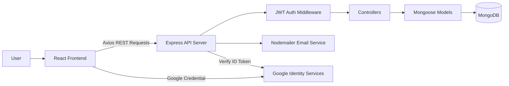
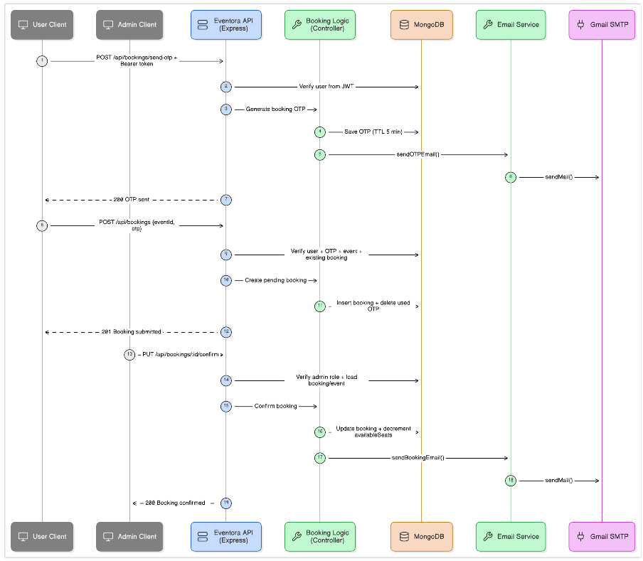
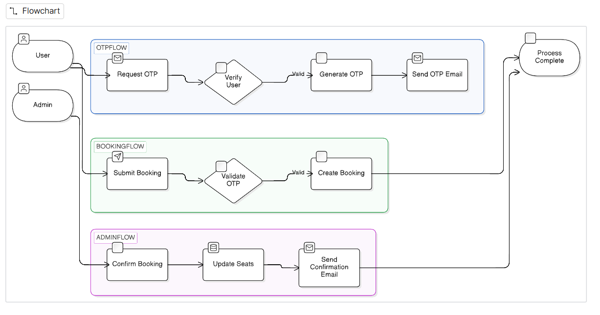

# Eventora - Full Stack Event Booking System

A production-ready MERN stack event booking application built as part of a **Full Stack Developer Internship Assessment**. The system allows users to register, log in, browse events, book seats, track booking history, and cancel bookings while keeping event seat availability consistent.

## Table of Contents

- [Overview](#overview)
- [Tech Stack](#tech-stack)
- [Features](#features)
- [Application Flow](#application-flow)
- [Folder Structure](#folder-structure)
- [Architecture](#architecture)
- [Database Design](#database-design)
- [API Documentation](#api-documentation)
- [Environment Variables](#environment-variables)
- [Installation](#installation)
- [Assumptions](#assumptions)
- [Design Decisions](#design-decisions)
- [Security Considerations](#security-considerations)
- [Deployment](#deployment)
- [Screenshots](#screenshots)
- [Future Enhancements](#future-enhancements)

## Overview

Eventora is a full stack event booking platform where users can securely authenticate, view available events, submit booking requests, and manage their bookings. The backend exposes REST APIs for authentication, events, and bookings, while the React frontend consumes those APIs using Axios.

The application includes:

- Secure user registration, login, and logout
- JWT-based protected routes
- Password hashing with bcrypt
- Event listing and event detail pages
- Booking creation with availability validation
- Booking history for authenticated users
- Booking cancellation
- Automatic seat restoration when confirmed bookings are cancelled
- Optional Google Sign-In using Google Identity Services

## Tech Stack

### Frontend

- React.js
- React Router
- Axios
- Tailwind CSS
- Google OAuth client integration

### Backend

- Node.js
- Express.js
- JWT Authentication
- bcrypt password hashing
- CORS
- Nodemailer for email notifications

### Database

- MongoDB
- Mongoose ODM

## Features

### Authentication

- User registration
- User login
- Logout
- JWT-based authentication
- Protected backend routes
- Password encryption using bcrypt
- OTP-based account verification
- Google sign-in support

### Event Management

- Fetch all events
- Search and category filtering support
- View event details
- Display event name, description, date and time, venue, category, total seats, available seats, ticket price, and image
- Admin-only event create, update, and delete APIs

### Booking Management

- Send booking OTP
- Book an event after OTP verification
- Select the number of seats before booking
- View current user's bookings
- Cancel booking
- Restore booked seats automatically when a confirmed booking is cancelled
- Prevent duplicate active bookings for the same event
- Prevent confirming bookings when no seats are available

### Validation and Error Handling

- Prevent overbooking
- Validate JWTs on protected routes
- Return proper HTTP status codes
- Return meaningful error messages
- Restrict admin APIs with role-based authorization

## Application Flow

The application is designed around a complete event booking journey:

1. **User opens the Event Dashboard**
   - The user starts on the Discover / Event Dashboard.
   - Events are shown with category filters, search, ticket price, seat availability, and event cards.
   - The user selects an event to inspect details before booking.

2. **User views event details and starts booking**
   - The Event Detail page shows event description, venue, date, ticket price, total seats, and available seats.
   - The user chooses the number of seats to book.
   - The system validates that the selected seat count is available.
   - The user requests an OTP before submitting the booking.

3. **User verifies OTP and creates a booking request**
   - The backend sends an OTP to the logged-in user's email.
   - The user enters the OTP on the event page.
   - After successful OTP verification, a booking is created with `pending` status.
   - For paid events, the user is redirected to the payment page.

4. **User completes payment**
   - The Payment Dashboard displays the selected event, number of seats, and total amount.
   - The user enters payment details and submits payment.
   - Payment status is recorded as paid.
   - The booking still waits for admin approval after payment.

5. **Admin reviews the booking request**
   - The Admin Dashboard shows pending booking requests, paid clients, revenue, confirmed bookings, and event inventory.
   - The admin can approve the booking as paid or reject the request.
   - When the admin approves the booking, the booking status becomes `confirmed`.
   - The confirmed booking deducts the booked seat count from the event inventory.

6. **User tracks bookings from the User Dashboard**
   - The User Dashboard shows total requests, confirmed bookings, pending requests, paid spend, and cancelled bookings.
   - The user can view each booking's event, status, payment state, seat count, and amount.
   - Confirmed and pending bookings can be cancelled by the user.

7. **User cancels a booking**
   - If a user cancels a pending booking, the booking is marked as `cancelled`.
   - If a user cancels a confirmed booking, the booking is marked as `cancelled` and the booked seats are released back to the event inventory.
   - The event's available seat count is capped at the total seat count to avoid over-restoration.

## Folder Structure

```text
event-booking-system/
|
|-- client/
|   |-- src/
|   |   |-- components/
|   |   |-- context/
|   |   |-- pages/
|   |   |-- utils/
|   |   |-- App.jsx
|   |   |-- main.jsx
|   |   `-- index.css
|   |-- index.html
|   |-- package.json
|   |-- tailwind.config.js
|   `-- vite.config.js
|
|-- server/
|   |-- controllers/
|   |-- middleware/
|   |-- models/
|   |-- routes/
|   |-- scripts/
|   |-- utils/
|   |-- package.json
|   |-- seed.js
|   `-- server.js
|
|-- README.md
|-- SETUP_GUIDE.md
|-- package.json
`-- Eventora_Postman_Collection.json
```

## Architecture

The frontend communicates with the backend through REST APIs. The backend handles authentication, authorization, validation, and booking business logic. MongoDB stores users, events, OTP records, and bookings. JWTs secure protected routes by identifying the authenticated user on each request.

Booking logic ensures seat consistency by validating event availability before confirmation, decrementing available seats when a booking is confirmed, and restoring seats when confirmed bookings are cancelled.



## Database Design

### User Schema

```js
{
  name: String,
  email: String,
  password: String,
  googleId: String,
  authProvider: "local" | "google",
  role: "user" | "admin",
  isVerified: Boolean
}
```

### Event Schema

```js
{
  title: String,
  description: String,
  location: String,
  category: String,
  date: Date,
  totalSeats: Number,
  availableSeats: Number,
  ticketPrice: Number,
  image: String,
  createdBy: ObjectId
}
```

### Booking Schema

```js
{
  userId: ObjectId,
  eventId: ObjectId,
  seatsBooked: Number,
  status: "pending" | "confirmed" | "cancelled",
  paymentStatus: "paid" | "not_paid",
  amount: Number,
  bookedAt: Date
}
```

> Current implementation creates one active booking per user per event. Seat deduction happens when an admin confirms the booking, and the full booked seat count is restored if a confirmed booking is cancelled.

## API Documentation

Base URL:

```text
http://localhost:5000/api
```

Protected routes require:

```http
Authorization: Bearer <jwt_token>
```

### Auth APIs

#### Register

```http
POST /api/auth/register
```

Request:

```json
{
  "name": "Abhishek",
  "email": "abc@gmail.com",
  "password": "password123"
}
```

Success Response:

```json
{
  "message": "OTP sent to email. Please verify.",
  "email": "abc@gmail.com"
}
```

Error Response:

```json
{
  "message": "User already exists"
}
```

#### Verify Registration OTP

```http
POST /api/auth/verify-otp
```

Request:

```json
{
  "email": "abc@gmail.com",
  "otp": "123456"
}
```

Success Response:

```json
{
  "_id": "66a1b2c3d4e5f67890123456",
  "name": "Abhishek",
  "email": "abc@gmail.com",
  "role": "user",
  "authProvider": "local",
  "token": "jwt_token_here"
}
```

#### Login

```http
POST /api/auth/login
```

Request:

```json
{
  "email": "abc@gmail.com",
  "password": "password123"
}
```

Success Response:

```json
{
  "_id": "66a1b2c3d4e5f67890123456",
  "name": "Abhishek",
  "email": "abc@gmail.com",
  "role": "user",
  "authProvider": "local",
  "token": "jwt_token_here"
}
```

Error Response:

```json
{
  "message": "Invalid credentials"
}
```

#### Google Authentication

```http
POST /api/auth/google
```

Request:

```json
{
  "credential": "google_id_token_here"
}
```

Success Response:

```json
{
  "_id": "66a1b2c3d4e5f67890123456",
  "name": "Abhishek",
  "email": "abc@gmail.com",
  "role": "user",
  "authProvider": "google",
  "token": "jwt_token_here"
}
```

### Event APIs

#### Get All Events

```http
GET /api/events
```

Optional query parameters:

```text
?category=Technology
?search=music
```

Success Response:

```json
[
  {
    "_id": "66a1b2c3d4e5f67890123456",
    "title": "Tech Conference 2026",
    "description": "A full-day technology conference.",
    "location": "Delhi Convention Center",
    "category": "Technology",
    "date": "2026-08-15T10:00:00.000Z",
    "totalSeats": 100,
    "availableSeats": 72,
    "ticketPrice": 499,
    "image": "https://example.com/event.jpg"
  }
]
```

#### Get Event Details

```http
GET /api/events/:id
```

Success Response:

```json
{
  "_id": "66a1b2c3d4e5f67890123456",
  "title": "Tech Conference 2026",
  "description": "A full-day technology conference.",
  "location": "Delhi Convention Center",
  "category": "Technology",
  "date": "2026-08-15T10:00:00.000Z",
  "totalSeats": 100,
  "availableSeats": 72,
  "ticketPrice": 499,
  "image": "https://example.com/event.jpg"
}
```

Error Response:

```json
{
  "message": "Event not found"
}
```

#### Create Event Admin Only

```http
POST /api/events
```

Request:

```json
{
  "title": "Tech Conference 2026",
  "description": "A full-day technology conference.",
  "location": "Delhi Convention Center",
  "category": "Technology",
  "date": "2026-08-15T10:00:00.000Z",
  "totalSeats": 100,
  "ticketPrice": 499,
  "image": "https://example.com/event.jpg"
}
```

### Booking APIs

#### Send Booking OTP

```http
POST /api/bookings/send-otp
```

Success Response:

```json
{
  "message": "OTP sent successfully"
}
```

#### Create Booking

```http
POST /api/bookings
```

Request:

```json
{
  "eventId": "66a1b2c3d4e5f67890123456",
  "otp": "123456"
}
```

Success Response:

```json
{
  "message": "Booking request submitted",
  "booking": {
    "_id": "77a1b2c3d4e5f67890123456",
    "userId": "66b1b2c3d4e5f67890123456",
    "eventId": "66a1b2c3d4e5f67890123456",
    "status": "pending",
    "paymentStatus": "not_paid",
    "amount": 499
  }
}
```

Error Response:

```json
{
  "message": "No seats available"
}
```

#### Get User Bookings

```http
GET /api/bookings/my
```

Success Response:

```json
[
  {
    "_id": "77a1b2c3d4e5f67890123456",
    "status": "pending",
    "paymentStatus": "not_paid",
    "amount": 499,
    "eventId": {
      "_id": "66a1b2c3d4e5f67890123456",
      "title": "Tech Conference 2026",
      "location": "Delhi Convention Center"
    }
  }
]
```

#### Cancel Booking

```http
DELETE /api/bookings/:id
```

Success Response:

```json
{
  "message": "Booking cancelled successfully"
}
```

#### Confirm Booking Admin Only

```http
PUT /api/bookings/:id/confirm
```

Request:

```json
{
  "paymentStatus": "paid"
}
```

Success Response:

```json
{
  "message": "Booking confirmed successfully",
  "booking": {
    "_id": "77a1b2c3d4e5f67890123456",
    "status": "confirmed",
    "paymentStatus": "paid"
  }
}
```

#### Mark Booking As Paid

```http
PUT /api/bookings/:id/pay
```

Success Response:

```json
{
  "message": "Payment recorded successfully"
}
```

## Environment Variables

### Backend `.env`

Create this file locally as `server/.env`. Do not commit real values or completed connection strings.

```env
PORT=5000
MONGO_URI=your_mongodb_atlas_connection_string
JWT_SECRET=generate_a_secure_random_jwt_secret
CLIENT_URL=http://localhost:5173
GOOGLE_CLIENT_ID=your_google_oauth_client_id
EMAIL_USER=your_email_address
EMAIL_PASS=your_email_app_password
SMTP_HOST=smtp.gmail.com
SMTP_PORT=587
SMTP_SECURE=false
```

| Variable | Description |
| --- | --- |
| `PORT` | Backend server port. Defaults to `5000`. |
| `MONGO_URI` | MongoDB connection string. Keep the completed URI private. |
| `JWT_SECRET` | Long random secret used to sign JWT tokens. Keep it private. |
| `CLIENT_URL` | Frontend origin allowed by CORS. Use the deployed frontend URL in production. |
| `GOOGLE_CLIENT_ID` | Google OAuth client ID used to verify Google sign-in tokens. |
| `EMAIL_USER` | Email account used for OTP and booking notifications. |
| `EMAIL_PASS` | Email app password or SMTP password. |
| `SMTP_HOST` | SMTP host. Optional for Gmail because it defaults to `smtp.gmail.com`. |
| `SMTP_PORT` | SMTP port. Optional for Gmail because it defaults to `587`. |
| `SMTP_SECURE` | Whether SMTP uses implicit TLS. Optional for Gmail because it defaults to `false` for STARTTLS on port `587`. |

For multiple deployed frontend URLs, use:

```env
CLIENT_URLS=https://frontend-one.com,https://frontend-two.com
```

### Frontend `.env`

Create this file locally as `client/.env`. Only variables prefixed with `VITE_` are exposed to the browser.

```env
VITE_API_URL=http://localhost:5000/api
VITE_GOOGLE_CLIENT_ID=your_google_oauth_client_id
```

| Variable | Description |
| --- | --- |
| `VITE_API_URL` | Backend API base URL used by Axios. |
| `VITE_GOOGLE_CLIENT_ID` | Google OAuth client ID used by the browser client. |

## Installation

### Clone Repository

```bash
git clone <repository-url>
cd Eventora
```

### Backend

```bash
cd server
npm install
npm run dev
```

Backend runs on:

```text
http://localhost:5000
```

### Frontend

```bash
cd client
npm install
npm run dev
```

Frontend runs on:

```text
http://localhost:5173
```

### Run From Root

```bash
npm install
npm run install:all
npm run dev
```

## Assumptions

- One booking belongs to one user.
- A user can have only one active booking per event.
- Current booking flow represents one seat per booking.
- Users cannot book more seats than are available.
- JWT tokens expire after the configured backend duration.
- Events are pre-created by an admin or database seed.
- Seat deduction happens when an admin confirms a booking.
- Confirmed booking cancellation restores seat availability.

## Design Decisions

- **MongoDB** was chosen because event and booking data fit naturally into flexible document models.
- **Mongoose ODM** provides schema validation, model relationships, and cleaner database queries.
- **JWT authentication** keeps the API stateless and allows secure protected routes.
- **REST architecture** makes the client-server contract simple, predictable, and easy to test with tools like Postman.
- **Centralized booking logic** ensures availability checks, duplicate booking prevention, booking status updates, and seat restoration happen on the backend.
- **Seat inventory consistency** is handled by validating availability before confirmation, decrementing seats only on confirmation, and restoring seats on cancellation. For high-concurrency production workloads, this can be strengthened further with MongoDB transactions or conditional atomic `$inc` updates.

## Security Considerations

- Passwords are hashed using bcrypt before storage.
- JWT authentication protects private APIs.
- Admin-only APIs are protected with role-based middleware.
- CORS restricts allowed frontend origins.
- Secrets are stored in environment variables.
- Real `.env` files are ignored by Git; commit only `.env.example` placeholders.
- Google sign-in ID tokens are verified on the backend.
- OTP verification adds an extra layer for account verification and booking confirmation.
- Meaningful errors are returned without exposing sensitive server internals.

## Deployment

### Frontend Deployment on Vercel

1. Import the `client` project into Vercel.
2. Set build command:

```bash
npm run build
```

3. Set output directory:

```text
dist
```

4. Add frontend environment variables:

```env
VITE_API_URL=https://your-backend-domain.com/api
VITE_GOOGLE_CLIENT_ID=your_google_oauth_client_id
```

### Backend Deployment on Render or Railway

1. Create a new Web Service from this repository.
2. For a backend-only deploy, set the root directory to:

```text
server
```

3. Set the build command:

```bash
npm install --legacy-peer-deps
```

4. Set the start command:

```bash
npm start
```

5. Add backend environment variables. Render provides `PORT` automatically, so you do not need to set it manually:

```env
MONGO_URI=your_mongodb_atlas_connection_string
JWT_SECRET=generate_a_secure_random_jwt_secret
CLIENT_URL=https://your-frontend-domain.com
GOOGLE_CLIENT_ID=your_google_oauth_client_id
EMAIL_USER=your_email_address
EMAIL_PASS=your_email_app_password
SMTP_HOST=smtp.gmail.com
SMTP_PORT=587
SMTP_SECURE=false
```

### MongoDB Atlas

1. Create a MongoDB Atlas cluster.
2. Create a database user.
3. Add your deployment IP or allow access from required hosts.
4. Copy the connection string into `MONGO_URI` in your local `server/.env` or hosting provider dashboard only.
5. If a MongoDB URI is ever committed, rotate the database user's password immediately.

### Google Cloud OAuth Setup

In Google Cloud Console, add these Authorized JavaScript origins:

```text
http://localhost:5173
https://your-frontend-domain.com
```

No trailing slash is required.

## Project Diagrams

### Booking Data Flow



### Booking Flowchart



## Future Enhancements

- Admin dashboard enhancements
- Payment gateway integration
- Email notification templates
- Seat selection UI
- Redis caching
- Docker deployment
- CI/CD pipeline
- Real-time seat updates using Socket.io
- MongoDB transactions for stricter high-concurrency seat updates
- Automated test suite for API and frontend flows
